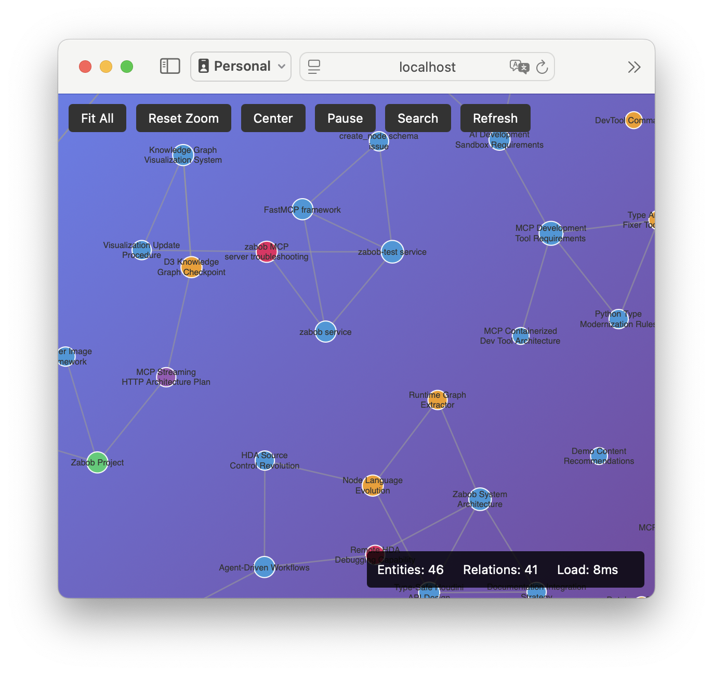

# Zabob Memgraph - Knowledge Graph Server

A Model Context Protocol (MCP) server for persistent knowledge graph storage with interactive web visualization. Part of the Zabob AI assistant ecosystem, designed for thread-safe multi-client support with Docker deployment.

**📖 See [USAGE_PATTERNS.md](USAGE_PATTERNS.md) for detailed deployment options**

Imagine a future where your AI assistant not only can talk to you, but can remember important things, and can show you everything it remembers.

 Zabob remembers this future! Give him your plans and dreams, and he will remember not just the dream, but the journey to get there, even through the darkest nullspace.



## Features

- **MCP Protocol** - Standard Model Context Protocol for AI assistant integration
- **Multiple Transports** - HTTP/SSE for server mode, stdio for Claude Desktop
- **Thread-safe SQLite backend** - WAL mode for concurrent access without locking
- **Interactive D3.js visualization** - Real-time graph exploration via web UI
- **Docker deployment** - Multiple deployment patterns (HTTP server, stdio, local)
- **Persistent storage** - Database with automatic backups and rotation
- **Full-text search** - Search across entities, observations, and relations
- **Modern tooling** - esbuild bundler, Python type checking, comprehensive tests

## Quick Start

### Docker Compose (Recommended)

```bash
# Clone repository
git clone https://github.com/BobKerns/zabob-memgraph.git
cd zabob-memgraph

# Start HTTP server with web UI
docker-compose up -d

# Access web UI at http://localhost:8080
# MCP endpoint at http://localhost:8080/mcp
```

### Claude Desktop Integration

Add to your Claude Desktop MCP config:

```json
{
  "mcpServers": {
    "zabob-memgraph": {
      "command": "docker",
      "args": [
        "run", "--rm", "-i",
        "-v", "${HOME}/.zabob-memgraph:/app/.zabob-memgraph",
        "bobkerns/zabob-memgraph:latest",
        "stdio"
      ]
    }
  }
}
```

**See [USAGE_PATTERNS.md](USAGE_PATTERNS.md) for more deployment options**

## Usage

### Basic Commands

```bash
# Start the server (auto-assigns port)
zabob-memgraph start

# Start on specific port
zabob-memgraph start --port 8080

# Run in Docker
zabob-memgraph start --docker --detach

# Check server status
zabob-memgraph status

# Monitor server health
zabob-memgraph monitor

# Test all endpoints
zabob-memgraph test

# Stop server
zabob-memgraph stop
```

### Development Commands

If you're developing or contributing to the project:

```bash
# Clone the repository
git clone <repository-url>
cd zabob-memgraph

# Set up development environment
./zabob-memgraph-dev.py install

# Build web UI bundle (required before first run)
pnpm install
pnpm run build:web

# Run in development mode with auto-reload
./zabob-memgraph-dev.py run --reload

# Build Docker image
./zabob-memgraph-dev.py build

# Run tests
./zabob-memgraph-dev.py test

# Format code
./zabob-memgraph-dev.py format

# Clean up
./zabob-memgraph-dev.py clean
```

## Configuration

### Data Directory

Configuration and data are stored in `~/.zabob-memgraph/`:

```text
~/.zabob-memgraph/
├── config.json           # Server configuration
├── server_info.json      # Current server status
├── memgraph.log          # Application logs
├── data/                 # Database files
│   └── knowledge_graph.db
└── backup/               # Automatic backups
    ├── knowledge_graph_1234567890.db
    └── ...
```

### Configuration File

The `config.json` file supports these options:

```json
{
  "default_port": 8080,
  "default_host": "localhost",
  "log_level": "INFO",
  "backup_on_start": true,
  "max_backups": 5,
  "data_dir": "~/.zabob-memgraph/data"
}
```

### Environment Variables

For Docker or advanced deployments:

```bash
export MEMGRAPH_HOST=0.0.0.0
export MEMGRAPH_PORT=8080
export MEMGRAPH_LOG_LEVEL=DEBUG
export MEMGRAPH_CONFIG_DIR=/custom/path
```

## MCP Tools

Zabob Memgraph provides these MCP tools for AI assistants:

- **create_entities** - Create new entities with observations
- **create_relations** - Create relationships between entities
- **add_observations** - Add observations to existing entities
- **read_graph** - Read the complete knowledge graph
- **search_nodes** - Full-text search across entities and observations
- **delete_entities** - Remove entities and their relations
- **delete_relations** - Remove specific relationships
- **get_stats** - Get graph statistics

### HTTP Endpoints

When running in HTTP server mode:

- `GET /` - Web visualization interface
- `POST /mcp` - MCP protocol endpoint (SSE transport)
- `GET /health` - Health check

### Using MCP Tools

MCP tools are called through the protocol. Example using the web UI:
1. Open http://localhost:8080
2. View entities and relations in the interactive graph
3. Search, zoom, and explore your knowledge graph

For Claude Desktop integration, tools are automatically available after configuration.

## Architecture

### Thread-Safe Design

The server uses SQLite with proper locking for concurrent access:

- **WAL mode**: Enables concurrent readers
- **Proper transactions**: Atomic operations prevent corruption
- **Connection pooling**: Efficient resource management
- **Automatic retries**: Handles temporary locking conflicts

### Component Structure

```text
zabob-memgraph/
├── zabob-memgraph-dev.py         # Development CLI
├── main.py                       # Server entrypoint
├── memgraph/                     # Core package
│   ├── service.py                # Unified ASGI service (MCP + HTTP)
│   ├── mcp_service.py            # FastMCP server implementation
│   ├── knowledge_live.py         # Knowledge graph data layer
│   ├── sqlite_backend.py         # Thread-safe SQLite backend
│   ├── web/                      # Static web assets
│   │   ├── index.html
│   │   ├── graph.bundle.js       # Bundled web UI (built)
│   │   └── style.css
│   └── web-src/                  # Web UI source
│       ├── mcp-client.js         # Browser MCP client
│       └── graph.js              # D3.js visualization
├── docker-compose.yml            # Docker Compose config
└── Dockerfile                    # Container definition
```

## Development

### Setting Up Development Environment

```bash
# Clone repository
git clone <repository-url>
cd zabob-memgraph

# Install dependencies
./zabob-memgraph-dev.py install

# Run in development mode
./zabob-memgraph-dev.py run --reload --port 8080

# Run tests
./zabob-memgraph-dev.py test

# Lint code
./zabob-memgraph-dev.py lint
```

### Docker Development

```bash
# Build development image
./zabob-memgraph-dev.py build

# Run with Docker Compose
./zabob-memgraph-dev.py docker-run

# View logs
./zabob-memgraph-dev.py logs

# Stop services
./zabob-memgraph-dev.py docker-stop
```

## Troubleshooting

### Common Issues

**Server already running**:

```bash
zabob-memgraph status
zabob-memgraph stop
```

**Port conflicts**:

```bash
zabob-memgraph start --port 8081
```

**Docker issues**:

```bash
# Check if image exists
docker images | grep zabob-memgraph

# Build if missing
./zabob-memgraph-dev.py build
```

**Database issues**:

```bash
# Check logs
tail -f ~/.zabob-memgraph/memgraph.log

# Test server endpoints
zabob-memgraph test
```

### Logs and Debugging

```bash
# View real-time logs
tail -f ~/.zabob-memgraph/memgraph.log

# Monitor server health
zabob-memgraph monitor

# Test all endpoints
zabob-memgraph test
```

## Performance Notes

- **SQLite Performance**: Excellent for read-heavy workloads with WAL mode
- **Docker Deployment**: Recommended for production with volume persistence
- **Memory Usage**: Low footprint suitable for resource-constrained environments
- **Scaling**: Scale horizontally with multiple instances on different ports

## Part of the Zabob Ecosystem

Zabob Memgraph is designed to work with other Zabob AI tools:

- **Zabob Core**: Main AI assistant framework
- **Zabob Memgraph**: Knowledge graph persistence (this project)
- **Zabob Tools**: Additional MCP tools and utilities

The `zabob-` prefix helps identify tools in this ecosystem while maintaining distinct, memorable names.

## Contributing

1. Fork the repository
2. Create a feature branch
3. Use the development tools:

   ```bash
   ./zabob-memgraph-dev.py install
   ./zabob-memgraph-dev.py test
   ./zabob-memgraph-dev.py lint
   ```

4. Submit a pull request

## License

[License information]

---

**Getting Started**: `zabob-memgraph start`
**Need Help**: `zabob-memgraph --help`
**Issues**: [GitHub Issues](https://github.com/your-username/zabob-memgraph/issues)
