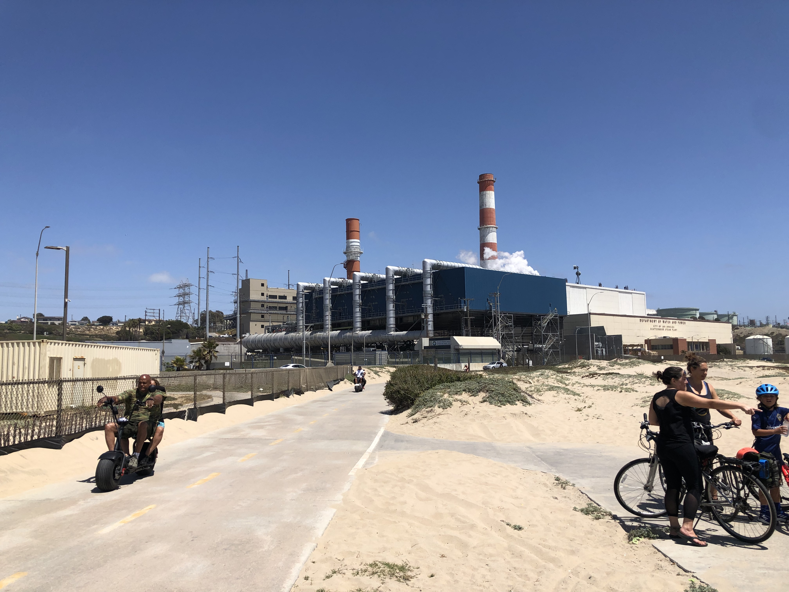
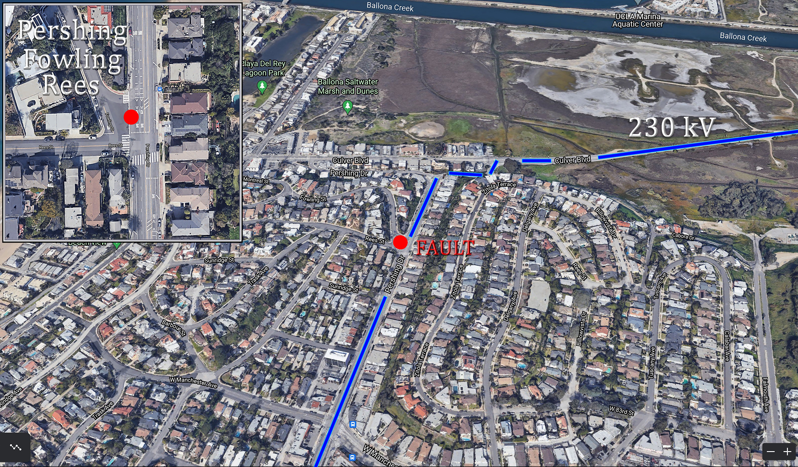
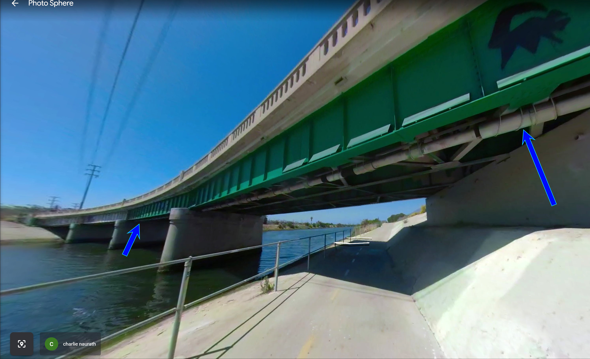
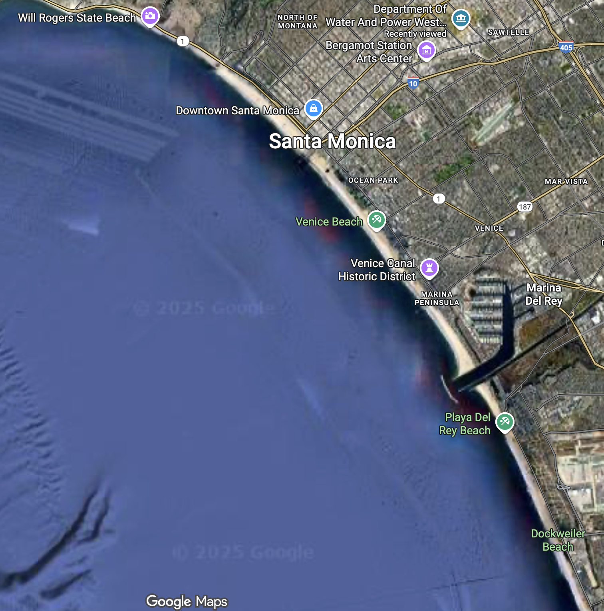
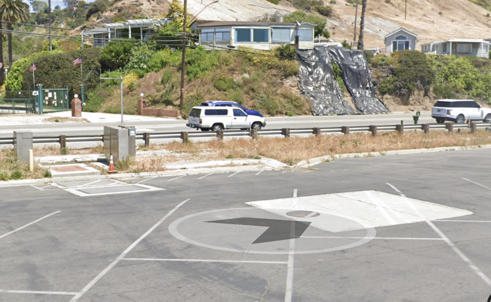
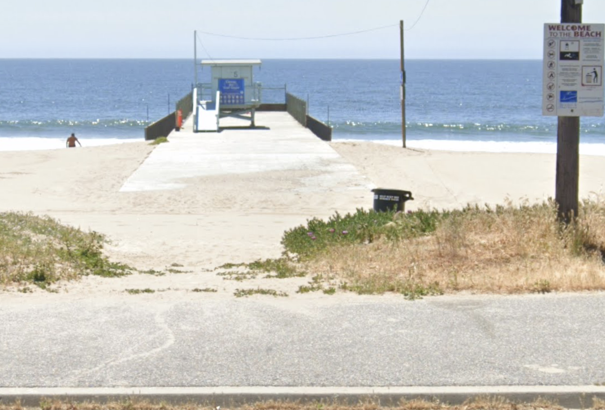
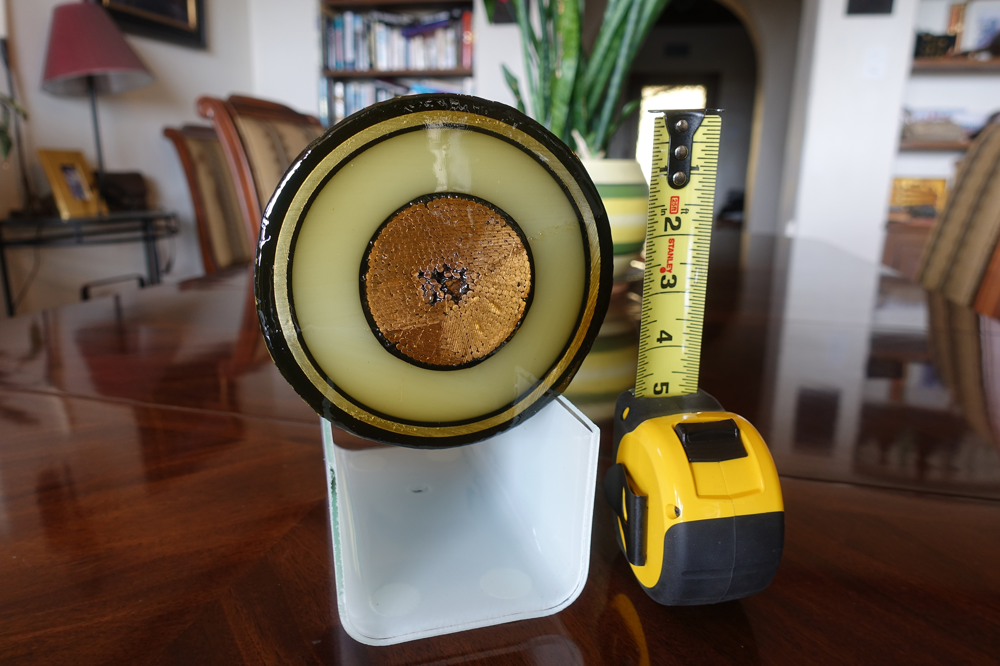

# The Scattergood-Olympic Underground Transmission Line Repair (1989)

**Author:** Thomas L. McMahon (TLM)
**Original Distribution:** Symbolics internal mailing list (\<Hardware@riverside.scrc.symbolics.com>)
**Date:** September-December 1989
**Preservation Note:** This document was preserved by Jamie Zawinski on his blog after spreading across early internet bulletin boards. It is no longer publicly available online. This copy is from an original recipient's archive.

To protect this document from such a fate, I have established a separate [Errata page](errata.md)[^errata]

---

**Date:** Wed, 27 Sep 89 10:27 PDT
**From:** "Thomas L. McMahon" \<tlm@riverside.scrc.symbolics.com>
**Subject:** Cuts and jumpers (on a different scale)
**To:** \<Hardware@riverside.scrc.symbolics.com>

[Not quite the right mailing list but close. If you don't care about megawatts, bus bars bigger than your wrist, things that cause ground loops out to Hawaii, or big hairy construction projects hit D now.]

---

Several days ago a very large number of trucks and men from the Los Angeles Department of Water and Power descended on my neighborhood. They removed large sections of Pershing drive to a depth of 15 feet or so over a stretch of about a city block. I assumed they had a problem with a water main or something.

When they started building semi-permanent structures over the holes I knew something really big was up. When the large trucks full of strange power tools, mega-welding machines, breathing equipment, and racks of test equipment came I started wondering. Driving by a couple nights ago (11 PM), I noticed that the pace hadn't slowed - they were at it 24 hours a day.

My curiosity got the best of me yesterday when they brought in the giant tanks full of liquid nitrogen. LN-2 for the DWP? I parked my car and played the lookie loo.

It turns out they have a problem with an underground wire. Not just any wire but a 230 KV, many-hundred-amp, 10 mile long coax cable. It shorted out. (Lotta watts!) It feeds (fed) power from the Scattergood Steam Plant in El Segundo to a distribution center near Bundy and S.M. Blvd.

To complicate matters the cable consists of a copper center conductor living inside a 16 inch diameter pipe filled with a pressurized oil dielectric. Hundreds of thousands of gallons live in the entire length of pipe. Finding the fault was hard enough. But having found it they still have a serious problem. They can't afford to drain the whole pipeline - the old oil (contaminated by temporary storage) would have to be disposed of and replaced with new (pure) stuff which they claim takes months to order (in that volume). The cost of oil replacement would be gigantic given that it is special stuff. They also claimed the down time is costing the costing LA \$13,000 per hour. How to fix it and fast?

That's where the LN-2 comes in. An elegant solution if you ask me. They dig holes on both sides (20-30 feet each way) of the fault, wrap the pipe with giant (asbestos-looking) blankets filled with all kind of tubes and wires, feed LN-2 through the tubes, and *freeze* the oil. Viola! Programmable plugs! The faulty section is drained, sliced, the bad stuff removed, replaced, welded back together, topped off, and the plugs are thawed. I was amazed.

---

**The next day:**

Last night the DWP held a curbside chat to allay the neighborhood's fears that they were going to accidentally blow us all up. Apparently all the vapor clouds from all the LN-2 blowoff had caused a great deal of concern.

**Interesting bits:**

The feeder was laid 17 years ago and was designed to have an MTBF of 60 years. There are other similar feeders in use around California, in the Pacific North West, and some on the east coast. This was the first failure in the western US. No one out here had any idea how to fix it so they brought in experts from the east. (NYC has had some faults.)

This link is a very critical part of the LA power grid. Last night the city engineers verified the \$13,000 per hour power cost figure quoted the day before. (I guess that means they are being forced to buy power off the grid somewhere else.)

There are actually three center conductors (they had a cross sectional model to show us). Each is about 3" in diameter with a one inch solid copper core. Each is wrapped with hundreds of layers of a special paper. That, in turn, is sheathed with copper and then each one is spiral-wrapped its entire segment-length with a 1/4 inch bronze "wire". The three conductors are then twisted together during the pulling process. The bronze spiral wraps form a kind of linear bushing with minimal contact area with the inside of the pipe so it's "easy" to pull each segment. Ha.

Each of the three legs in the feeder carrys 600-800 Amps (depending on demand) of 230KV three phase power. The ground return is the Santa Monica Bay. Down at the Scattergood Steam Plant and up in Santa Monica they have a giant copper anchors out in the bay.

They lay these things in 2000 foot segments. 2000' is the longest segment they can pull through the steel pipe. The pipe is laid first and then the internal cable(s) are pulled through. Tensile forces must be enormous. At each segment joint (splice) there is a very large and expensive ($100K) underground vault. Future technology may allow them to go 3000 feet, reducing the number of vaults needed per run, thereby saving money.

After the feeder was originally built (and the cable pulled) it was thoroughly evacuated to both leak test and remove any contaminants. It was flushed with dry nitrogen and then reevacuated. Golden Bear High Tension Oil was then slowly added while still maintaining a vacuum so as to "pull" any residual gas contaminants out of the oil and the cables in the pipe. The pipe, full of oil, is then pressurized to about 200 PSI for some period of time before it gets powered up. 200 PSI is maintained during operation to keep any bubbles from forming and to drive insulating oil into the paper.

At both ends of the pipeline they have 6000 gallon tanks of Golden Bear lightly pressurized under a blanket of dry nitrogen. There are pumps at both ends. There is about 100K gallons in the entire pipeline, not including the 6K gal tanks. Every six hours they reverse the pumps so the oil oscillates back and forth in the pipe. The pumps only run at 3 gallons per minute but that is enough, over 6 hours, to get the oil in each 2000 foot segment to go at least a segment or two length in either direction. This eliminates hot spots in the copper conductors and spreads the heat out over several thousand feet. A little competitive pressure is always maintained between the pumps to get the 200 PSI.

They learned the hard way that you simply don't reverse the pumps lest you get the Golden Bear equivalent of water hammer. The last hour of every 6 hour cycle is spent slowly reducing the oil velocity down to zero before you reverse it and then slowly ramp back up in the other direction.

In between segments, in the vaults, are temperature sensors embedded in the pipe. These monitor the oil temperature. These are wired to a computer downtown. Because the oil oscillates, the DWP can track the temperature gradient along the pipe and get an early indication of the location of any hot spot problems. They have regularly spaced flow rate and pressure monitors for the same purpose - detecting and isolating faults.

Every vault also has a nipple which allows sampling of the pipe oil. They said you withdraw the oil through a thick membrane with a syringe (?). This happens monthly on all feeders in the LA area. The samples are analyzed downtown by a staff of chemists who can relate the presence of things like acetylene, butane, and benzene in the oil to arcing, coronas, and so forth. Apparently the oil chemistry is a very good indicator of the health of the segments.

One of their worst fears, after they open up the pipe, is having a blowout of the freeze plugs. If they ever run out of nitrogen during the repair process they'll lose one side of the pipe (or both). Right now they've got the pipe on each side of the fault dropped down to 80 PSI. They are afraid that if they go any lower in oil pressure any gas in the oil will come out of solution and cause an explosive expansion. Not only that, but since there is so much oil embedded in the paper insulation, any sort of gas bubbling (oil foaming) would shred the insulation, rendering the entire feeder useless. They say it could take months to safely let the pressure off to zero. (That is the other reason ($13k/hr) they cannot afford to drain the whole pipe.)

Even at 80 PSI, if they lose a freeze plug they will have a really big mess outside the pipeline. The holes they've dug cannot hold 100K gallons and they're operating on a hill near the beach anyway... (Big pollution threat for LA basin.) Potentially fatal for anyone around. Right now they have LN-2 companies on call from San Diego to San Francisco with contingency plans of all sorts in case there is a major traffic problem with trucks getting in.

They say the repair could take weeks or more, depending on what they find when they get inside. They believe the cause of the fault was the inner conductors slipping downhill inside the pipe and shorting against a metal flange. Even if that's true they wonder where it slipped to, and hence, where it may be bunched up down hill.

Finding the fault was a problem in itself. Since this was all new to them they really didn't know how to start. They tried time-domain reflectometry equipment but got inconclusive information. They tried ultrasound and radar but that didn't work. Then they got a thing called a "thumper" shipped in which got them pretty close. The thumper sends mondo-amp pulses into one end of the cable. The electromotive force tends to cause physical displacement of the conductors which you can hear from the street level. The place where the clicking stops is where the problem usually is. This got them to the defective segment.

What pinpointed the problem in the end was a bunch of car batteries and some millivoltmeters. (From one technology extreme to the other.) They hooked up car batteries to both ends, tapped the cable at several points (maybe there are taps in the vaults?) and, knowing the drops and resistance of the cable, got within a few feet of the fault. (I used to use the exact same technique on memory boards.)

Next came the X-Ray equipment. Sure enough, they can see the cable shorting against the steel wall of the pipe.

Once all of the repair is done they still have to close it up. How do you weld a steel pipe with paper insulation inside? Slowly. They have special heliarc welding equipment and "certified operators" who take 8 hours to weld around one cross section of pipe. They are required to keep their hand on the pipe no more than 3 inches from the tip of the welder. If it is too hot for their hand they stop and let it cool. After all, they can't afford another failure.

---

## Oct 20, 1989 Update

I am getting all of these bits from a guy named Jim who is the project manager. He looks kinda like a red neck RWK (Jesus in a hard hat with a Harley belt buckle). [RWK is Bob Kerns, an ex-Symbolics person, 6'6" tall, skinny, bearded. -- DLW] He is a really great guy. Jim was one of the splicers on the project 17 years ago when he was working his way through school. He is a now professional electrical and mechanical engineer. After having worked his way up through the ranks at the DWP he is now The Big Boss. He claims to be having the time of his life - back in the field with one of the biggest challenges of his career. If we ever recruit a VP of engineering I would hope its someone like him.

So, what went wrong? Varying load conditions in the three legs of the 3-phase circuit caused tremendously strong and dynamic magnetic field changes. The electromagnetic forces between the three conductors and the steel pipe (gack!) cause the conduit to wiggle around inside the pipe. Over many years (and under the influence of gravity) the thing slipped and wiggled every which way. Also, due to very slight diametric temperature gradients, the differential thermal expansion of a cable that big across causes bending and warping forces. Nobody ever thought of any of this.

Wiggle alone may not have cause the problem, however. The spices between cable segments are much larger in diameter than the cable itself. The steel pipe at these points is much larger than the main run. So the whole affair get fat and then shrinks down every 2000 feet or so. What really screwed them was failure to put any sort of clamp at the splices to keep the fat splice from getting pulled into the narrower main runs. This is what cause the fault.

Jim says the fault lasted 20 milliseconds before breakers tripped. (The breakers for a wire like this are pretty amazing in their own right. They use high pressure gas to blow out the arc as the circuit begins to open. Anything that can cut off this number of megawatts in 20 ms gets my respect.) It blew carbonized oil about 3000 feet down the pipe to either side of the fault. (Compute velocity...)

They will be removing a long length of cable from the faulted area for analysis. The entire length will be dissected. Jim says the insulation they have inspected at so far looks like shredded cauliflower due to the explosion from the fault and the gas bubbling in it. (BTW - The insulation consists of 118 layers of paper tape.)

Based on X ray imaging they are going to have to open up 14 of the 23 splices along the 10 mile run. They'll have to drain the pipe to do so. It will take them 2 months to take the pipeline down (depressurize and drain). (The oil will be recycled - see below.) At each of the opened splices they are going to install special aluminum (non magnetic) collars around the conductors to keep the splices from getting pulled into the necked-down section of the pipe. These collars are being specially fabricated now and will be ready in about a month.

At each splice they have to build a semi clean room to keep dirt, moisture, worker sweat, and any other contaminants out of the joint before closing. After all, we're talking a quarter megavolt! They have special air conditioning and filter units for the vaults. Each joint will take two months of work. They will get some degree of parallelism in the phase of the project.

After repairing and replacing the faulted section of cable, stabilizing all of the splices, and buttoning it all up comes the job of putting the oil back in. First the pipe is evacuated and then back-filled with nitrogen etc as I described earlier. After extensive filtering, the oil is heated to about 230 degrees farenheit. It gets injected into a vacuum chamber at the temperature thorough hundreds of spray nozzles. This gets the maximum possible surface area so all the crap in it boils out into the chamber. The good stuff that's left is collected and pumped immediately into one end of the pipeline.

Then they power it up and see if it works. If not, they start over again. I'll keep you posted.

---

## 12/11/89

The pipeline is now completely drained and filled with nitrogen at atmospheric pressure. They are still in the process of opening up many of the splices to install the collars. They originally planned on doing 14 of them but now the number is 17.

The splice where the short happened, and the cable for about 40 feet to either side of it, has been completely replaced. Engineering prototypes of the aluminum collars are now installed there and the whole thing is all welded back together. They built new vaults under the street where the new splices are. The trucks, men, and their equipment are all gone and the roadbed has been repaved. They consider the segment where the short happened "fixed". We'll see...

Now that they verified the assembly of a splice with the new collars in it (to make sure they had the details right) they are going ahead with the fab run for the 17 other joints. They won't be done installing them until mid April. Then they'll put the oil in as described above and power it up slowly. I don't expect to have much to report until then and I promise to send an update.

Assuming 8 month down time the cost of the electricity alone will approach $75 million!

---

## [Final Update]

[After many queries of "So how did it all work out?"]

... I am sure that you will all get this final message in due time.

You see, I found out yesterday that even the Department of Water and Power repair crew got copies! It rattled across electronic bulletin boards around the country and eventually ended up in the hands of a DWP manager who promptly showed it to the team. Small world. Every time you turn over a rock you find that we are all connected.

So, here's the scoop:

They are back on line. The failure was attributed to "TMB", short for Thermal Mechanical Bending. There have been several similar failures on the east coast but this was the first out here. TMB causes the cable to wiggle in place due to load surges. This eventually causes insulation failure due to abrasion against the pipe and separation of the many layers of paper tape. They repaired the short, put aluminum collars in most of the joints to hold the splices in place, and have added a load management scheme to reduce the current peaks. They powered it up and the darned thing works. Amazing.

I'll impulse them again in a few months to see if there is any news.

---

## Epilogue

**2018 Replacement:** After continued insulation degradation and reliability issues, the LA Department of Water and Power replaced the Scattergood-Olympic line with a modern polyethylene-insulated system. The original line remains in place as backup. ([Source: Practical Engineering video, 2021](https://www.youtube.com/watch?v=z-wQnWUhX5Y))

**Internet Folklore:** This story spread across early internet bulletin boards and mailing lists in 1989-1990, becoming one of the defining examples of technical storytelling from the pre-web era. It demonstrates both the challenges of large-scale infrastructure engineering and the power of sharing knowledge across nascent networks.

**Preservation:** This document was preserved on Jamie Zawinski's blog after the original bulletin board postings faded. Special thanks to jwz for maintaining this piece of internet history through multiple platform transitions.

---

**About the Author:** Tom McMahon worked at Symbolics Corporation, a pioneering artificial intelligence and Lisp machine company, during the late 1980s. This account was originally shared on an internal hardware mailing list and became one of the most widely circulated engineering stories of the early internet era.

**Referenced Person:** Bob Kerns (RWK) was also at Symbolics during this period and became an informal unit of measurement in this story. He is 6'6" tall rather than the 6'7" reported in the original text.

**Referenced Person:** [Daniel L. Weinreb](https://en.wikipedia.org/wiki/Daniel_Weinreb). RWK here in person, since the AI that wrote the epilog didn't recognize him when he explained me. Dan and Tom were both co-founders of Symbolics (there were many; I joined a bit later). Together with Tom, they created the Eine and Zwei text editors (in the Emacs family tree), at the time, Zwei was the most advanced text editor, and the foundation for many of our most advanced features. The Lisp Machine environment was, top-to-bottom, a live IDE environment, even to the OS and Zwei was tightly integrated.

Dan was arguably the warmest and most approachable of all of the founding team, (all of whom I remember fondly). He was involved in local theater groups with his family. In addition to all the roles you can find in his Wikipedia article and elsewhere on the net, he was an angel investor who helped several companies get off the ground.

He died of cancer in 2012, and all of us who knew him miss him deeply.

**Further notes on Tom McMcmahon:** Tom's technical contributions are strongest on the hardware side of computer graphics. Here's something I wrote years ago, in a context I no longer remember, briefly about Tom, before summarizing the entire early history of CGI, leaving out many I wish I'd included. But it also illustrates another of the historical arcs and how events and people are connected—a major motivation for the project here.

> Science, Technology, and Society Discussion Corner  ·
> Bob Kerns \[Moderator] July 30, 2018
>
> From my friend Tom McMahon. (Tom is a bit of a graphics pioneer himself; he created the hardware that was used by Triple-I to create Tron, as well as the Symbolics genlock hardware that synchronized our display hardware to video.)
> This is a pretty incredible event; I wish I could be there.
> Ivan Sutherland is responsible in one way or another for most of the field of computer graphics. From his PhD thesis (Sketchpad, '69, including geometric constraints), to his students (Danny Cohen @ Harvard, clipping algorithms), to an entire generation of CGI pioneers at Utah (the Utah teapot, an actual physical teapot used to test the first 3D shading algorithms, is on display at the Computer History Museum).
> His students included Alan Kay (Smalltalk, object-oriented programming, windowed graphical user interfaces, Atari, Apple), and Ed Catmull, co-founder of Pixar and now head of Disney.
> He co-founded Evans and Sutherland, pioneering display tech (among other things) flight simulators. Alumni include Jim Clark (founder of SGI) and John Warnock (founder of Adobe).
> Each of these in turn lead, inspired, hired, and mentored others.

But important to the context of the story, Tom is also a life-long resident of of the Playa Del Rey/Playa Vista community, effectively the local historian, and through him I know more about Playa Del Rey, is history, and its local politics than I do my own community. Tom has contributed large numbers of historic engineering documents about LA to various university collections, having rescued them from, oblivion with his connections with the USGS and others, producing archival-quality scans and sharing them widely.

He has also preserved a copy of the original email on archive.org[^copy]

**Notes on Playa Del Rey:** My own connections to Playa Del Rey are limited; my wife worked there for a time for the Rhythm & Hues effects company between when they moved there until 1995. I often drove past the then-visible remnants of the Hughes airport, former home of the Spruce Goose. But we're here to talk about the energy infrastructure and history, and it's a topic I know a bit about myself.

First, some geography. At the very bottom right corner, you can't quite make out Scattergood power plant. But you can barely make out the Hyperion waste treatment plant just to its north. To preserve what detail I could, I cropped out the massive Chevron oil refinery immediately to the south (El Segundo, for which the city is named; El Primero is up here n Richmond). I'll get back to that a bit.

But here's a picture from Wikipedia that's better than anything I can provide:

> By Facewizard - Own work, CC BY-SA 4.0, https://commons.wikimedia.org/w/index.php?curid=121758072

Go up the coast and you can see the ends of LAX runways 24L/R and 25 L/R. We'll touch on what lies underneath those in a moment, but it's not our cable; that runs along Pershing Drive just off the end of the airport in that area. And you can see clearly the Santa Monica airport.

But while we're here, let's stop and appreciate that these dunes are the home of the endangered [El Segundo Blue butterfly](https://en.wikipedia.org/wiki/El_Segundo_blue).

But it travels along Pershing to Culver, crosses the Ballona wetlands (We'll back), to S Centinela,and Bundy.

In more detail, here's the fault location

And how it crosses Ballona Creek

(Both images courtesy TLM)

At the very top, you can make out the LA Department of Water and Power (so much history behind that name!). The blue marker to its right denotes Receiving Station K, the our cable's destination.

So that's our electrical path north. The story mentions the ground returns, anchors off Dockweiler Beach and in the Santa Monica Bay. I don't have any details on those, but see where it says Will Rogers State Beach?

There, in the parking lot, is the similar but grander southern ground return of the HVDC Pacific Intertie, 3.1 GW of power link between LA and hydropower in the Dardanelles, Oregon.

 

There used to be a nice video of the work of replacing the anchor a few years bac, from the barge contractor if I remember correctly, but it doesn't seem to be online.

**So where does this energy come from?**

You might think, with the Chevron refinery next door, it comes from there, but you'd be wrong. That's oil, Scattergood is a gas-fired plant, important for meeting peak loads.

But LA's history with oil comes into it[^la-oil-wells]. Take a look at this map.

- The red rectangle is the Chevron plant I mentioned.
- Green is the Scattergood Generating Station[^scattergood], central to this whole story.
- Pale blue is some black dots on LAX runways.
- Black dots? Abandoned oil wells. At this scale, they stack on top of each other. Yes, including under LAX runways. LA is a sieve![^la-oil-wells]
- And in the dark blue rectangle, we see other colors of dots.

This is the Southern California Gas Company's (SoCalGas) Playa Del Rey natural gas storage field. The gas is natural, the storage field is not. It is a repurposed former oil field, now storing natural gas on demand to local customers, especially Scattergood and the Harbor Generating Station in San Pedro.

It turns out, natural gas doesn't move through transmission lines as quickly and easily as you might expect. The gas transmission lines in the area operate at around 200 psi (1.4 MPa), but even so, it's a gas, and not very dense, maybe 8 kg/m³. That's why gas storage fields are important to meeting peak demand.

It is much like its much larger sibling, the Aliso Canyon field with the huge blowout in 2016, but smaller and more local. The Aliso Canyon blowout left Southern California short on gas, jump starting our investment in battery storage of electricity instead.

(I am trying to stay on topic while still tying it to the much larger contexts this all connects to. See [^aliso])

This is the pumping and dewatering infrastructure for the PDR field. I am preparing a separate document about it, see[^pdr-field].

### The 2018 Update

A new cable was laid parallel to the original in 2018. It parallels the original, with the original left in place as backup.

Here's a cross-section of the new cable, made with modern insulation. This was sent to Tom by the LADWP in recognition of his original posting, which has long been famous within the department.

I could go into a LOT more detail, about Scattergood's past and future[^scattergood]. Its last upgrade cost nearly $1B, which isn't out of line for our energy infrastructure; the next will be considerably more. The capital investment in our energy and communications networks is staggering.

Personally, I don't think Scattergood itself should have a future of any significance. Originally, its advantage was access to gas from the sewage plant next door[^hyperion], and cooling water from the ocean.

But Hyperion has its own 28 MW cogeneration facility (two turbines) since 2015.

The real value lies not in Scattergood itself, but in the established transmission corridors. It is difficult to convey just how critically important and valuable these are, especially in urban areas. To create new paths for energy projects is nearly impossible. Instead, as with the 2018 update, we must upgrade existing corridors to meet growing demand.

But Scattergood is not without value. It is there, connected, and with a resource with value quite independent of the gas and steam turbines—the generators themselves. One future would be to take out the turbines and leave the generators in place, spinning with a small amount of power flowing the other direction. The value lies in the inertia of those spinning masses. That is a form of short-term energy storage that can make the grid more stable, more resistant to changes in voltage or frequency.

The technical term for such an arrangement is a *synchronous condenser*. Batteries can provide synthetic inertia with even more flexibility, but if you have a generator in place, connected, it can be an inexpensive way to include inertia. Insufficient inertia played a role in the 2016 South Australia blackout and again in the 2025 Iberian Penninsula blackout.

And Scattergood is not well-suited for a large battery storage project. Experience at Moss Landing shows that batteries modules need to be isolated from each other to contain and limit fire risk.

But as part of the network, it isn't going away, even if reduced to just another connection point.

It is about the network. About the connections, always.

But rather go into more detail here, let me close with sort of a postscript from Tom himself, from just last year.

> Los Angeles Department of Water and Power
> Corporate Environmental Affairs
> Environmental Planning and Assessment
> Attn: Jazmin Martin
> 111 North Hope Street, Room 1044
> Los Angeles, CA 90012
>
>
> Dear Jazmin –
>
> Regarding “Scattergood Units 1 & 2 Modernization Project”:
>
> Replacing the generation capacity of existing Scattergood Units 1 and 2 with a modern, higher efficiency rapid-response combined-cycle generation system (CCGS) operating solely on natural gas (using no hydrogen at all) will result in lower emissions, lower operating costs, and greater reliability in short-term periods when renewable generation sources and/or transmission assets for the LA Grid become unavailable due to emergency circumstances. This modernization, plus elimination of the once-through cooling (OTC) system planned to be executed in parallel with the Modernization Project, achieves a major step forward in environmental benefits at the Scattergood Peaker Plant LA Grid node. That will be true with no use of hydrogen at all.
>
> At this point I do not believe that hydrogen (of any color) will ever actually be employed in normal future operation of this facility, simply due to the cost and logistics of H2 production and transport. Environmentally, financially, and engineering-wise the proposed CCGS project and draft EIR are a good thing and a good deal for the City of Los Angeles. The engineering and current operation of the LA Grid requires a Peaker Plant at that node. The hydrogen veneer employed as a selling point and justification for the modernization was/is an unfortunate and unnecessary distraction. Opponents to possible future employment of a hydrogen mix at this new facility may wish to focus on decoupling that part of the dialog as it is a separable option; the Modernization & CCGS Project itself should proceed.
>
> Thank you and best regards,
>
> Tom McMahon
---

### Why is this here? On Github? In this project?

You may be wondering why I chose this place to post this?

First is context. Working on this project led directly to my discovery that the old link was dead. It was discussion with my AI agent (Claude Sonnet 4.5) and the various connections and options that led to this choice.

It is more intimately tied than a surface reading would suggest. This project is building a knowledge-graph memory for AI agents and humans working together, providing a way to manage networks of related concepts.

**It is all about the connections**. In a network, the connections matter more than the nodes. The Scattergood/Olympic cable is just one link in a vast network of infrastructure. Electricity, gas, water, are all tied together, and LA is the perfect case study, with it's deep history in each of these areas.

We made extensive use of the [zabob-memgraph MCP facility](https://github.com/BobKerns/zabob-memgraph) in preparing this. Or we made extensive use of this in exercising zabob-memgraph, depending on your viewpoint.

There is another level as well: The people, AI, and computer graphics.

TLM, RWK, DLW—our use of these initials stems from our logins on the MIT AI/LCS systems in the 1970s. Symbolics[^symbolics] grew out of the AI lab, and we were pioneers in both networks and computer graphics. Symbolic.com was the first .com domain registered, March 15, 1985. Craig Reynold's Boids flocking algorithm debuted with the short *Stanley and Stella, Breaking the Ice* at the 1986 SIGGRAPH.

There are direct ties back to the original CGI work at Ivan Sutherland's group at Utah through Triple-I[^triple-i] via TLM and others. The larger project of which this is a part, seeks to bring AI assistance to people working in the Houdini[^houdini] graphics environment—specifically, inspired by work on creating virtual worlds for training today's crop of AI systems.

### References

To help this update be a stable document, and to avoid overwhelming the reader, I am separating out more detailed information and source materials into separate documents which can be updated.

[^errata]: So this can be a permanent link, I have established a separate [Errata Page](errata.md)
[^copy]: Tom's archival copy of the email. [[archive]](https://archive.org/details/engineering-pornography-this-is-one-of-my-favorite-geek-stories-of-all-time/page/n7/mode/2up)
[^aliso]: [Aliso Canyon History](aliso-canyon-history.md). The Aliso Canyon storage field's 2015 methane leak had a profound impact on California's energy trajectory. It links to this story both through its sibling [PDR Storage field](playa-del-rey-gas-storage.md)[^pdr-field], and through its impact on energy policy that will determine the future of Scattergood and this cable.
[^la-oil-wells]: [LA's Oil History](la-oil-wells.md) Los Angeles has a long but declining history of oil and gas extraction. [Aliso Canyon](aliso-canyon-history.md) was headline news, but there are thousands of smaller, quieter problems.
[^pdr-field]: The [Playa Del Rey Storage Field](playa-del-rey-gas-storage.md) is an important part of the full context of the cable, being the immediate supply of energy to [Scattergood](scattergood-reference.md).
[^scattergood]: The Scattergood Generating Station, history, technical information.
[^hyperion]: Hyperion is one of the world's largest water recovery treatment plants. Its connections to this story are not just geography, but also as a former supplier of gas to Scattergood, and in the larger context, the output end of the long history of Los Angeles water, which is intimately tied to its energy story, from Mulholland,the dams, the aqueduct and associated hydropower, the pumped hydropower storage, and yes, its wastewater and associated biogas.
[^triple-i]: [Information International, Inc](https://ohiostate.pressbooks.pub/graphicshistory/chapter/6-3-information-international-inc-triple-i/), an pioneer in CGI for films, including work on *Tron*. [[Archive]](https://web.archive.org/web/20250620081517/https://ohiostate.pressbooks.pub/graphicshistory/chapter/6-3-information-international-inc-triple-i/).
[^houdini]: Product of [SideFX Software](https://sidefx.com) [[archive]](https://web.archive.org/web/20251109005920/https://www.sidefx.com/). Houdini describes graphics pipelines as graphs.
